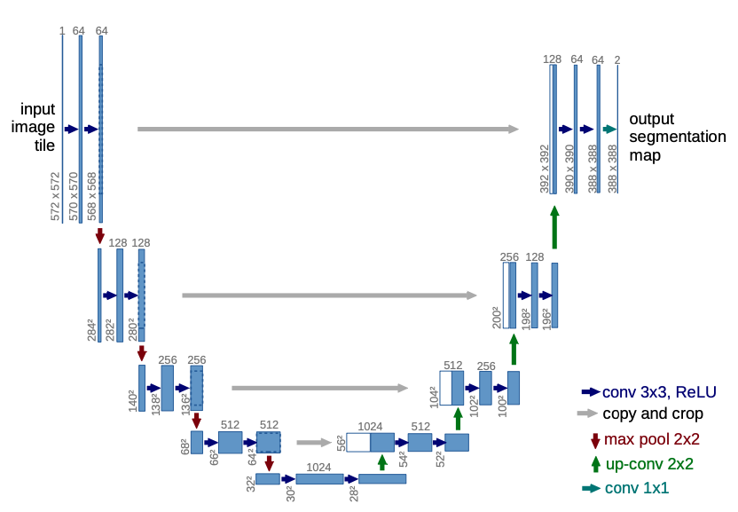
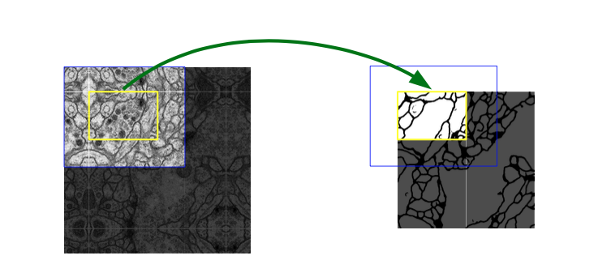

# U-Net
# Network Architecture

ネットワークは，ネットワークアーキテクチャは，収縮パス（左側）と拡張パス（右側）で構成されている．

収縮パスは，畳み込みネットワークの典型的なアーキテクチャに従っている．これは，2つの3x3畳み込み（パディングなし）の繰り返し適用によって構成されており，それぞれでReLU(Rectified Linear Unit)とダウンサンプリングのための2x2でストライドが2のMaxPooling操作が続いている．

それぞれのダウンサンプリングのステップで，特徴量チャネル(feature chennels)の数を2倍する．

拡張パスのすべてのステップは特徴量マップのアップサンプリングと，それに続く特徴量チャネルの数を半分にする2x2の畳み込み（"up-convolution"），収縮パスから対応してトリミング（クリッピング）された特徴量マップと，それぞれにReLUが続く2つの3x3の畳み込みとの連結で構成される．

トリミング（クロッピング）は，すべての畳み込みで境界ピクセルが失われるのため必要となる．

最終層で1x1の畳み込みを行い，64成分特徴ベクトルを希望のクラス数にマッピングする．

合計で，ネットワークは23の畳み込み層をもつ．

出力されるセグメンテーションマップをシームレスにタイリングするためには，すべての2x2 max-pooling操作が偶数のxサイズとyサイズのレイヤーに適用されるように，入力タイルサイズを選択することが重要．

